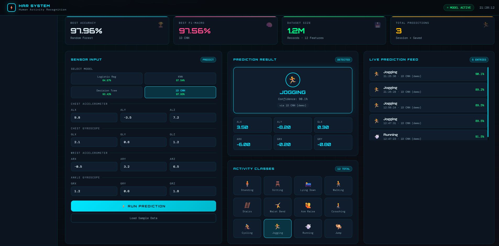
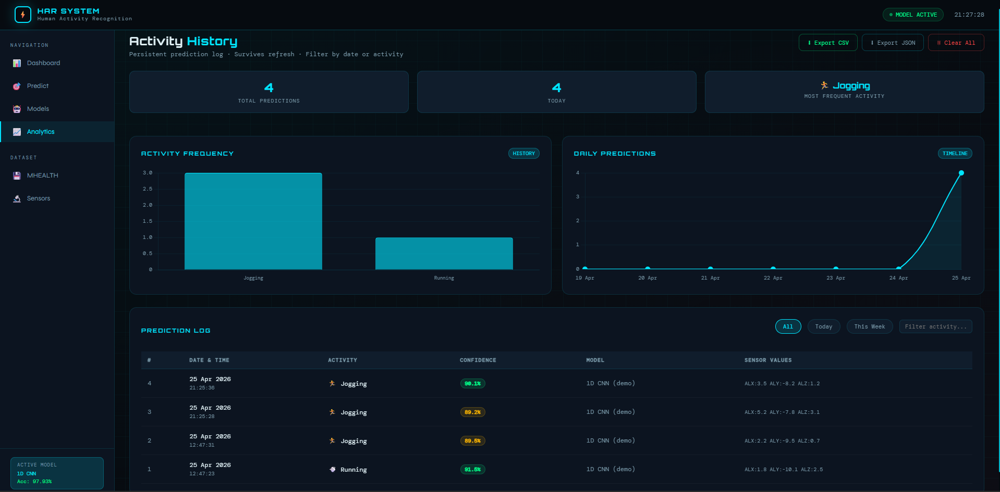
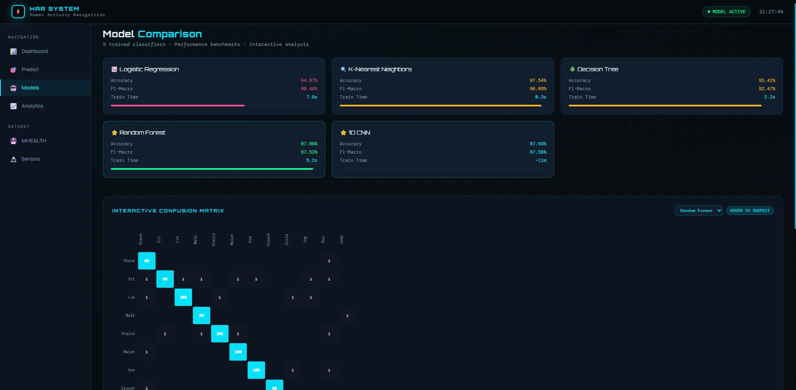
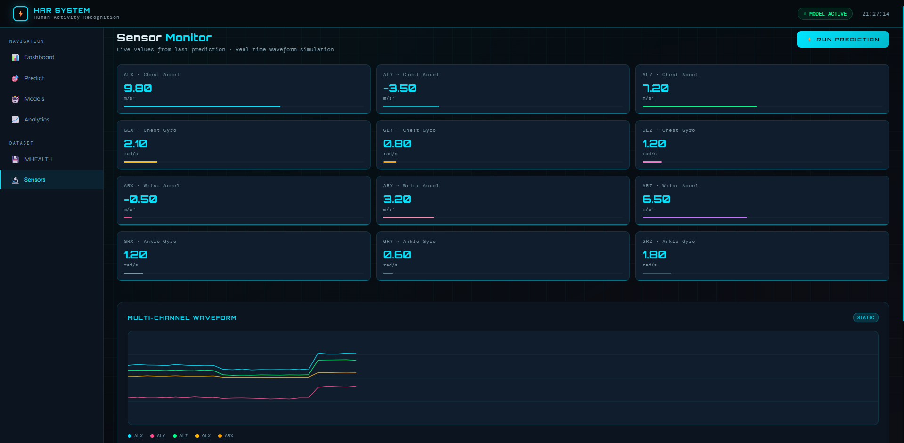

# 🧠 HAR System — Human Activity Recognition

<div align="center">


**A full-stack Machine Learning platform for real-time Human Activity Recognition using wearable sensor data.**

[Live Demo](#) · [API Docs](#api-endpoints) · [Dataset](#dataset) · [Results](#model-performance)

</div>

---

## 📌 Overview

HAR System classifies 12 human physical activities from body-worn sensor data using 5 trained ML/DL models. Built on the **MHEALTH dataset** (1.2M records, 10 subjects, 50Hz sampling), it features a Spring Boot REST backend, a Python Flask ML inference service, a MySQL persistence layer, and an interactive frontend dashboard.

> *"The body never lies — machines can now read it."*

---

## ✨ Features

- **5 ML Models** — Logistic Regression, KNN, Decision Tree, Random Forest, and 1D CNN
- **Real-time Prediction** — sensor values → predicted activity in milliseconds
- **Persistent History** — all predictions saved with timestamps, filterable by date/activity
- **Interactive Dashboard** — model comparison charts, confusion matrix, radar analysis, live waveform
- **REST API** — Spring Boot backend with full CRUD + stats endpoints
- **Export** — download prediction history as CSV or JSON
- **Mobile Responsive** — works on phone, tablet, and desktop
- **Fallback Classifier** — heuristic classifier keeps the app running if ML service is down

---

## 🏗️ Architecture

```
┌─────────────────────────────────────────────────────────┐
│                      FRONTEND                           │
│          Vanilla JS · HTML · CSS (index.html)           │
│   Dashboard · Predict · Models · Analytics · Sensors    │
└─────────────────┬───────────────────────────────────────┘
                  │ HTTP (fetch API)
                  ▼
┌─────────────────────────────────────────────────────────┐
│                   SPRING BOOT BACKEND                   │
│              Java · REST API · Port 8080                │
│   PredictController → PredictService → MySQL DB         │
└─────────────────┬───────────────────────────────────────┘
                  │ HTTP (RestTemplate)
                  ▼
┌─────────────────────────────────────────────────────────┐
│                 PYTHON ML SERVICE                       │
│              Flask · TensorFlow · Port 5000             │
│   Logistic Reg · KNN · Decision Tree · RF · 1D CNN      │
└─────────────────────────────────────────────────────────┘
```

---

## 📁 Project Structure

```
Human_Action_Detection/
│
├── 📂 data/
│   ├── raw/
│   │   └── mhealth_raw_data.csv        # Original MHEALTH dataset
│   └── processed/                      # Cleaned & scaled data
│
├── 📂 frontend/
│   └── index.html                      # Full frontend (single file)
│
├── 📂 models/                          # Trained model artifacts
│   ├── CNN_1D.keras                    # TensorFlow 1D CNN
│   ├── Random_Forest.pkl
│   ├── KNN.pkl
│   ├── Decision_Tree.pkl
│   ├── Logistic_Regression.pkl
│   └── scaler.pkl                      # StandardScaler
│
├── 📂 outputs/plots/                   # EDA & evaluation charts
│   ├── confusion_matrix_*.png
│   ├── model_comparison.png
│   ├── feature_distributions.png
│   └── ...
│
├── 📂 results/
│   └── results.txt                     # Model evaluation summary
│
├── 📂 har-backend/                     # Spring Boot project
│   └── src/main/java/com/har/
│       ├── controller/PredictController.java
│       ├── service/PredictService.java
│       ├── model/Prediction.java
│       └── repository/PredictionRepository.java
│
├── 01_preprocessing.py                 # Data cleaning & feature engineering
├── 02_eda.py                           # Exploratory Data Analysis
├── 03_models.py                        # Train ML models (RF, KNN, DT, LR)
├── 04_cnn.py                           # Train 1D CNN with TensorFlow
├── ml_service.py                       # Flask ML inference microservice
└── README.md
```

---

## 🤖 Model Performance

| Model | Accuracy | F1-Macro | Train Time |
|---|---|---|---|
| Logistic Regression | 64.87% | 60.46% | 7.9s |
| K-Nearest Neighbors | 97.54% | 96.89% | 0.3s |
| Decision Tree | 93.42% | 92.47% | 2.2s |
| **⭐ Random Forest** | **97.96%** | **97.52%** | 5.2s |
| **⭐ 1D CNN** | **97.93%** | **97.56%** | ~11m |

> Best accuracy: **Random Forest (97.96%)** · Best F1-Macro: **1D CNN (97.56%)**

---

## 📊 Dataset

**MHEALTH (Mobile Health)** — UCI Machine Learning Repository

| Property | Value |
|---|---|
| Total Records | ~1.2 Million (after preprocessing) |
| Subjects | 10 healthy volunteers |
| Activities | 12 (standing, sitting, lying, walking, stairs, waist bend, arm raise, crouching, cycling, jogging, running, jump) |
| Sensors | Chest accelerometer, chest gyroscope, wrist accelerometer, ankle gyroscope |
| Sampling Rate | 50 Hz |
| Selected Features | 12 (ALX, ALY, ALZ, GLX, GLY, GLZ, ARX, ARY, ARZ, GRX, GRY, GRZ) |

---

## 🚀 Getting Started

### Prerequisites

- Python 3.10+
- Java 17+
- Maven 3.8+
- MySQL 8.0+
- Node.js (optional, for live server)

---

### 1. Clone the Repository

```bash
git clone https://github.com/ananya-7123/Human-Activity-Recognition.git
cd Human_Action_Detection
```

---

### 2. Python ML Service Setup

```bash
# Install dependencies
pip install flask flask-cors scikit-learn numpy tensorflow joblib

# Start the ML microservice (port 5000)
python ml_service.py
```

Verify it's running:
```
http://localhost:5000/health
```

---

### 3. MySQL Database Setup

```sql
CREATE DATABASE har_db;
```

Update `har-backend/src/main/resources/application.properties`:
```properties
spring.datasource.url=jdbc:mysql://localhost:3306/har_db
spring.datasource.username=YOUR_USERNAME
spring.datasource.password=YOUR_PASSWORD
spring.jpa.hibernate.ddl-auto=update
ml.service.url=http://localhost:5000/predict
```

---

### 4. Spring Boot Backend Setup

```bash
cd har-backend

# Build and run
mvn spring-boot:run
```

Backend runs on `http://localhost:8080`

---

### 5. Frontend

Open `frontend/index.html` directly in your browser, or use VS Code Live Server:
```
http://127.0.0.1:5500/frontend/index.html
```

> ⚠️ Make sure both Python (port 5000) and Spring Boot (port 8080) are running before using the frontend.

---

## 🔌 API Endpoints

| Method | Endpoint | Description |
|---|---|---|
| `POST` | `/api/predict` | Run prediction from sensor data |
| `GET` | `/api/history` | Get last 20 predictions |
| `GET` | `/api/stats` | Activity & model usage stats |
| `GET` | `/api/health` | Backend health check |

### Sample Request

```bash
curl -X POST http://localhost:8080/api/predict \
  -H "Content-Type: application/json" \
  -d '{
    "features": {
      "alx": 9.8, "aly": -3.5, "alz": 7.2,
      "glx": 2.1, "gly": 0.8,  "glz": 1.2,
      "arx": -0.5,"ary": 3.2,  "arz": 6.5,
      "grx": 1.2, "gry": 0.6,  "grz": 1.8
    },
    "model": "1D CNN"
  }'
```

### Sample Response

```json
{
  "activity": "Jump",
  "confidence": 98.8,
  "modelUsed": "1D CNN",
  "id": 42,
  "timestamp": "2026-04-22T21:12:04"
}
```

---

## 🛠️ Tech Stack

| Layer | Technology |
|---|---|
| Frontend | HTML5, CSS3, Vanilla JS, Chart.js |
| Backend | Java 17, Spring Boot 3, Spring Data JPA |
| ML Service | Python, Flask, scikit-learn, TensorFlow |
| Database | MySQL 8 (via Hibernate ORM) |
| ML Models | Logistic Regression, KNN, Decision Tree, Random Forest, 1D CNN |
| Data | MHEALTH Dataset (UCI Repository) |

---

## 📸 Screenshots

### Dashboard — Live Prediction + KPI Overview


### Analytics — Persistent Prediction History


### Models — Interactive Confusion Matrix + Radar


### Sensors — Live Waveform Simulation


---

## 🗺️ Roadmap

- [x] Multi-model ML pipeline
- [x] Spring Boot REST API
- [x] MySQL prediction persistence
- [x] Interactive frontend dashboard
- [x] Persistent activity history (localStorage)
- [x] CSV / JSON export
- [x] Mobile responsive design
- [x] Interactive confusion matrix
- [x] Live sensor waveform
- [ ] Deploy to cloud (Render + Railway)
- [ ] WebSocket real-time streaming
- [ ] User authentication
- [ ] Mobile app (React Native)

---

## 👤 Author

**Your Name**
- GitHub: [@ananya-7123](https://github.com/ananya-7123)
- LinkedIn: [linkedin.com/in/YOUR_PROFILE](https://linkedin.com/in/YOUR_PROFILE)

---

## 📄 License

This project is licensed under the MIT License — see the [LICENSE](LICENSE) file for details.

---

## 🙏 Acknowledgements

- [MHEALTH Dataset](https://archive.ics.uci.edu/dataset/319/mhealth+dataset) — UCI Machine Learning Repository
- [scikit-learn](https://scikit-learn.org/) — ML model training
- [TensorFlow](https://www.tensorflow.org/) — 1D CNN implementation
- [Chart.js](https://www.chartjs.org/) — Frontend visualizations
- [Spring Boot](https://spring.io/projects/spring-boot) — REST backend framework

---

<div align="center">
  <sub>Built with ❤️ for learning, research, and real-world ML deployment</sub>
</div>